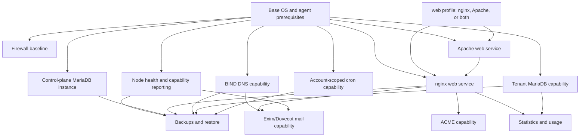

# ADR 0002: Service Installation, Configuration Ownership, and Build Sequencing

- Status: Accepted for design and scaffolding
- Date: 2026-08-26
- Scope: Ubuntu node bootstrap, runtime configuration, service dependency order, and implementation sequencing
- Governing document: `LESta-rewrite-plan.md`

## Decision Summary

LESta will use a two-stage host lifecycle:

1. A signed, pinned, operator-invoked bootstrap process installs the supported Ubuntu baseline and selected service packages.
2. The Go node agent continuously applies typed desired state through named capabilities.

The `.install` directory owns bootstrap and upgrade orchestration only. It is never called by Laravel, a controller, a queue job, or the node agent at request time. Runtime configuration assets belong to the versioned node-agent release, because the agent owns rendering and activation after bootstrap.

The implementation sequence is a modified Strategy C: contract and fake seam first, then a complete web slice, then its real Go capability, then installer hardening, followed by DNS, mail, databases, and cron as separate vertical slices.

## Conflict With the Governing Plan

The governing plan says in Phase 5 that the control plane should use PostgreSQL in one operational paragraph. That conflicts with its confirmed decision that MySQL/MariaDB is required. This ADR resolves the conflict in favor of MySQL/MariaDB. The operational wording must be corrected before implementation.

The governing plan does not specify an Ubuntu release. This ADR supports Ubuntu 24.04 LTS and 26.04 LTS, with both releases tested independently. It does not expand the supported operating-system family.

The governing plan names both nginx and Apache as possible service capabilities but does not define the blank-node selection model. This ADR supports `nginx`, `apache`, and `both`. In the `both` profile, nginx owns public ports 80 and 443 and proxies to Apache on a fixed LESta-owned loopback port. Tenant resources cannot select or change the web profile.

## 1. Bootstrap Versus Runtime

Bootstrap is an explicit operator action from a signed release artifact. It may perform OS preflight, package installation, service enablement, baseline users and directories, certificate authority trust setup, baseline firewall policy, and node-agent installation. It must not create tenant resources or consume control-plane desired state.

Runtime begins only after the node agent has registered and received a capability grant. Runtime operations render tenant and service configuration, validate it, activate it atomically, reload services, check health, report observed state, and roll back failed generations.

`.install` owns bootstrap, migrations between installer generations, package pinning, and recovery tooling. The node agent owns runtime rendering and service operations. Runtime must never invoke `.install`, and bootstrap must never accept arbitrary control-plane commands or tenant payloads.

This boundary is protected by separate artifacts, separate schemas, separate executable identities, and protocol review rules. The agent protocol has no `Install`, `UpgradePackages`, `RunCommand`, or arbitrary script operation. CI rejects capability manifests containing those operations. A future change adding a bootstrap capability requires a new ADR and security review.

## 2. Installer Language and Model

The installer is a small POSIX shell entrypoint plus declarative JSON manifests and pinned artifact metadata. It is not a Go subcommand of the agent. Shell is selected because it is available on a bare Ubuntu host, is inspectable by an operator, supports offline media, and aligns with native package and systemd tooling. It remains deliberately thin: it validates manifests and delegates only to fixed system tools with fixed argument construction.

Go remains the runtime agent because it provides a long-lived, typed, testable, memory-safe privilege boundary. Combining bootstrap into the agent would enlarge the trusted component, couple package lifecycle to runtime protocol releases, make recovery harder when the agent is broken, and require an agent installation before the installer can install the agent itself.

No installer is implemented in this step. The first executable installer will be written only after the web capability has passed its fake and real-agent acceptance gates.

## 3. Configuration Ownership

LESta owns only files under dedicated include, drop-in, state, and generation roots:

| Service | LESta-owned paths | Read-only paths | Refuse to touch |
| --- | --- | --- | --- |
| nginx | `/etc/nginx/lesta.d/`, `/var/lib/lesta/nginx/` | `/etc/nginx/nginx.conf`, distribution includes | operator config outside `lesta.d`, arbitrary web roots |
| BIND | `/etc/bind/lesta.d/`, `/var/lib/lesta/bind/` | distribution defaults and trust anchors | `/etc/bind/named.conf` and unrelated zones |
| MariaDB | `/etc/mysql/mariadb.conf.d/99-lesta.cnf`, `/var/lib/lesta/mariadb/` | distribution defaults | package-managed main files and host-wide authentication files |
| Exim/Dovecot | dedicated LESta include/drop-in directories and `/var/lib/lesta/mail/` | distribution defaults | operator-managed mail policy and unrelated service files |
| ACME | `/var/lib/lesta/acme/` | system CA trust | private keys outside the LESta secret root |
| cron | `/var/lib/lesta/cron/` and fixed per-account crontab fragments | system scheduler defaults | root crontab and unrelated users |
| firewall | LESta-owned nftables table only | existing tables | unrelated operator tables and emergency access rules |

The agent never rewrites distribution main configuration files. It renders a complete generation under `/var/lib/lesta/generations/<service>/<generation>/`, validates using the service's fixed syntax checker, and atomically switches a `current` symlink or include manifest. The previous generation is retained until the next successful health check and then retained according to a bounded generation policy. Activation and rollback are local filesystem transactions; service reloads are separate observable steps.

Observed state includes the generation ID and SHA-256 digest of every LESta-owned active file. The agent reports drift when the digest differs. Drift is not silently overwritten: the node is marked degraded, the control plane raises an audit event and notification, and reconciliation requires an explicit policy. The default policy is warn and reconcile only through the same validated activation path. A protected operator emergency mode may freeze reconciliation, with expiry and audit.

Templates are versioned with the agent release and identified by service, template name, and schema version. A new agent release can render all resources into a new generation without changing desired state. Templates are backward-compatible for one supported generation or provide an explicit migration renderer. No template reads arbitrary shell fragments or evaluates tenant input as code.

Secrets are stored in the control plane's encrypted secret store or an external secret manager, transferred only through the authenticated agent protocol when needed, and written under dedicated roots with the minimum service account ownership and mode. DKIM keys, database credentials, ACME account keys, and mail credentials are never included in normal desired-state payloads, Inertia props, logs, exception messages, backups in plaintext, or queue payloads. Secret rotation creates a new version, activates it, verifies health, and retires the old version only after a bounded grace period.

## 4. Idempotency and Re-runs

Bootstrap is convergent for the exact installer and manifest version. A second run performs preflight, reports no-op changes, and exits successfully. Partial installation resumes from recorded checkpoints after re-running preflight. Interrupted package or file changes are recovered by package-manager transactions where available and by restoring the prior generation for LESta-owned files.

Conflicting packages or services cause a typed preflight failure before mutation when detectable. The installer never silently removes or replaces an administrator's service. An explicit operator migration command, with a backup and confirmation outside unattended mode, is required for conflicts.

An upgrade installs a new generation beside the old one, validates compatibility, runs service checks, and switches only after all gates pass. Failure leaves the old generation active. Uninstall is not implicit and is outside the unattended contract.

## 5. Capability Registration

After bootstrap, the agent submits a signed registration containing node identity, installer version, agent version, Ubuntu release, architecture, package versions, enabled capabilities, capability schema versions, and health state. The control plane records this as observed node state and compares it to the required capability matrix.

A capability is usable only when its manifest requirements, agent protocol version, package versions, and health checks pass. A failed check changes the capability to `degraded` or `withdrawn`, preventing new provisioning while allowing safe reads and recovery operations. Existing desired state remains durable and is reconciled when health returns.

## 6. Service Order and Dependency Graph

The first release supports three blank-node web profiles: nginx only, Apache only, or both. The control-plane database and tenant database service are separate logical instances or hosts by default. They may share a physical node for the single-node deployment, but use separate database users, schemas, credentials, quotas, and network permissions. The control plane must never use tenant credentials or grant tenant accounts access to its schema. A separate physical host becomes mandatory when threat, load, or compliance requirements demand it.

Ordering rationale and gates:

1. **Base:** verify Ubuntu 24.04 or 26.04, architecture, disk, ports, package sources, time sync, kernel/security baseline, service accounts, directories, and agent prerequisites. Gate: all preflight checks pass and the signed manifest is verified.
2. **Firewall baseline:** establish SSH recovery access, HTTPS, DNS where enabled, mail ports only when mail is enabled, and deny-by-default policy. Gate: remote recovery and required control-plane connectivity are tested.
3. **Node health:** install the agent and register identity, protocol, package facts, and health reporting. Gate: mTLS and heartbeat work without exposing a shell capability.
4. **Control-plane MariaDB:** install the private control-plane instance or connect to an explicitly managed external instance. Gate: migrations, encrypted credentials, backups, and least-privilege accounts pass. This is not the tenant database feature.
5. **Web profile:** install nginx, Apache, or both according to the immutable blank-node selection. In `both`, nginx owns public ports 80 and 443 while Apache uses a fixed loopback backend port. Gate: profile-specific syntax validation, listener conflict checks, loopback health check, safe default vhost, and atomic rollback pass.
6. **ACME:** enable as a web capability. Gate: issuance works against the selected public web listener, staging issuance, per-account and per-node rate limits, retry backoff, challenge cleanup, key permissions, and renewal failure visibility pass.
7. **BIND:** install after the node and baseline are healthy. DNS is not required for local web syntax, but public ACME and mail depend on authoritative records. Gate: zone validation, serial handling, ACLs, transfer policy, and safe reload pass.
8. **Tenant MariaDB:** enable only after control-plane isolation is proven. Gate: separate credentials, resource limits, no control schema visibility, safe create/drop/rotate, and audit checks pass.
9. **Cron:** enable only with the account-scoped command policy. Gate: no root execution, rejected unsafe commands, bounded output, suspension handling, and execution auditing pass.
10. **Backups and restore:** add after all persisted desired state and generated artifacts have stable ownership. Gate: encrypted backup, integrity verification, access control, and a successful isolated restore drill.
11. **Statistics and usage:** add after resource identifiers and node telemetry are stable. Gate: bounded collection, incremental snapshots, pagination, and no dashboard N+1 behavior.
12. **Mail:** last, after DNS, the selected web profile, ACME, health, backups, and abuse controls pass. Gate: mail threat model, deliverability and abuse monitoring, DKIM rotation, queue limits, spam/antivirus isolation, TLS, and incident runbook approval.

The plan's feature phases and installation order differ intentionally: DNS is Phase 3 after web, while installation needs the base and node health before any service and needs DNS before mail. Installation dependency order wins for host bootstrap; product slice order wins for application implementation. Mail remains last in both because its readiness gate is independent.

## 7. Build Sequencing Decision

Adopt modified **C, vertical slice per service**:

1. Contract and threat model.
2. Control-plane foundation and typed fake seam.
3. Complete web slice against a fake adapter.
4. Real Go web capabilities for the selected profile on disposable Ubuntu.
5. Installer and release hardening for the proven web capability.
6. DNS, then ACME hardening, then tenant databases, cron, backups/statistics, and mail, each as a complete slice.

Strategy A, installation first, is rejected because it designs host behavior before desired-state and authorization contracts are proven, and risks a large unexercised installer rotting. Strategy B, UI first, is rejected because it creates screens around unstable resource states and provisioning outcomes, causing rework when policies and asynchronous failures are introduced.

The fake-first web seam in the governing plan is retained. It is not a deviation from Strategy C; it is the contract test stage within the web slice. Installation hardening moves after the real web capability because a release artifact should package behavior that has already been exercised.

Entry and exit criteria:

- **Phase 0 / plan Phase 0:** capability matrix, threat model, manifests, protocol draft, and acceptance criteria approved. Exit when every web mutation has ownership, policy, state transition, and failure semantics.
- **Phase 1 / plan Phase 1:** relational foundation, policies, outbox/idempotency, fake provisioner, and focused tests. Exit when duplicate delivery, rollback, and after-commit dispatch are proven without a node.
- **Phase 2 / plan Phase 2:** web CRUD, lifecycle, quotas, Inertia UI, Wayfinder routes, and browser tests. Exit when a customer can manage a domain and see honest provisioning state.
- **Phase 3 / plan Phase 2 completion:** real Go capability, protocol tests, staging/validation/activation/rollback, and disposable Ubuntu tests. Exit when fake and real adapters pass the same contract suite.
- **Phase 4 / plan Phase 5:** signed installer, manifests, checksums, SBOM, upgrade, rollback, and release archive tests. Exit when two clean Ubuntu releases install reproducibly and a failed upgrade preserves the previous generation.
- **Later slices / plan Phases 3-4:** repeat fake, control plane, UI, real capability, installer enablement, and service-specific security gates.

This decision is falsifiable. Revisit it if the real nginx or Apache capability invalidates the fake contract, if the combined profile cannot maintain safe listener separation, if a service dependency prevents a meaningful web acceptance test, if atomic rollback or least privilege cannot be achieved on the supported Ubuntu releases, or if installation exposes a fundamental desired-state flaw rather than a packaging defect.

## 8. Required Failure Behavior

- Installer interruption: checkpointed rerun, package-manager recovery, old generation remains active where possible, typed incomplete result.
- Installer rerun: preflight and convergent no-op, never duplicate users, ports, or configuration.
- Manual generated-file edit: digest drift, degraded capability, audit event, notification, explicit reconciliation policy.
- Syntax check failure: reject staged generation, preserve active generation, report structured validation error.
- Reload followed by failed health check: mark degraded, roll back to previous generation, revalidate health, retain evidence.
- Agent connection loss between staging and activation: activation uses a local receipt and idempotency key; retry queries the receipt or observed digest before acting again.
- Secret in installer log: redact at the logging boundary, fail CI with secret-pattern tests, rotate the exposed credential, and preserve an incident audit record.
- Unpinned package: manifest validation rejects it before mutation. Every external artifact requires an exact version, source, SHA-256 digest, and signature/provenance metadata.

## 9. Automated Enforcement

The installer contract will be enforced by a manifest schema validator, a static contract checker, shell linting, and disposable Ubuntu integration tests. The release pipeline must verify that every manifest reference exists, every artifact is pinned and checksummed, dependencies form an acyclic graph, supported OS versions are explicit, capabilities are named, and forbidden operations or paths are absent.

The release check must also run `git archive` and inspect its contents. `.install` is not ignored by `.gitignore`, is not marked `export-ignore` by `.gitattributes`, and is not consumed by Vite or Composer runtime packaging. It survives source archives when committed. The current CI does not yet enforce these checks; adding that CI is part of the installer hardening phase, not this scaffolding step.

## Open Decisions Before Implementation

1. **MariaDB version:** choose MariaDB 11.4 LTS or MySQL 8.4 LTS. The manifest format supports both, but the first implementation must choose one primary and one compatibility target.
2. **Ubuntu release support policy:** approve 24.04 and 26.04 as simultaneous targets, or reduce the first implementation to one release to lower test cost.
3. **ACME challenge mode:** choose HTTP-01 through nginx, DNS-01 through LESta-managed BIND, or both. Both increases capability and failure surface.
4. **Control-plane database placement:** choose a separate host, a separate local instance, or a separate logical instance on the same MariaDB server for the single-node deployment.
5. **Mail enablement:** require explicit operator opt-in after readiness review, or enable it by default on newly bootstrapped nodes after all gates pass.
6. **Web profile migration:** keep the blank-node profile immutable, or later support an explicit operator migration between nginx, Apache, and both with a staged port and rollback workflow.
